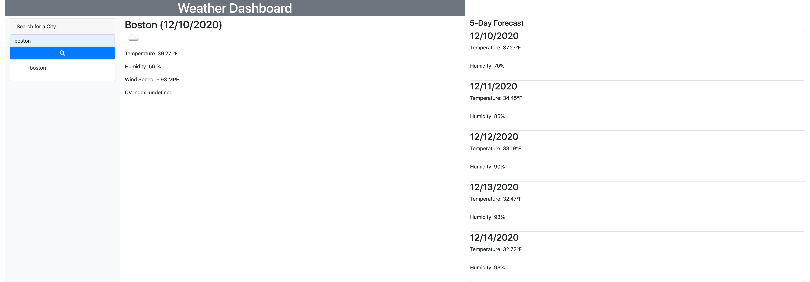

# weather-dashboard
Find weather forecast by searching for a city. Once city is input, you'll be able to see the current conditions and the five day forecast. This application was made using HTML, CSS, the CSS framework Bootstrap, JavaScript, and the JavaScript libraries jQuery and Moment.js.

Find the respository here: https://github.com/sldowd/weather-dashboard

Find the deployed application here: https://sldowd.github.io/weather-dashboard/

